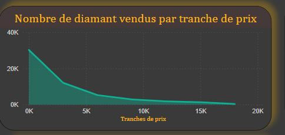
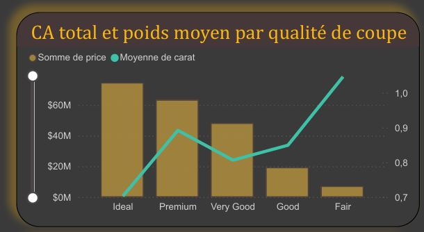
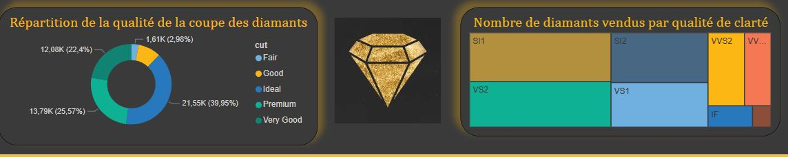

# Tableau de Bord d'Analyse des Ventes de Diamants

##  Aperçu de la Solution : Optimiser les Stratégies de Vente de Diamants

Dans un marché du diamant dynamique, la prise de décisions éclairées est cruciale. Ce tableau de bord Power BI a été conçu pour offrir une visibilité approfondie sur les tendances de vente, la performance des produits et la qualité des diamants, permettant aux professionnels de l'industrie d'optimiser leurs stratégies d'achat, de vente et de marketing.

Il transforme des données brutes en insights actionnables, répondant à des questions essentielles sur la rentabilité, les préférences clients et les opportunités de marché.

##  Objectifs et Questions Clés Abordées

Ce tableau de bord fournit des réponses claires aux interrogations suivantes :

* **Quel est le chiffre d'affaires global et la performance des ventes de diamants ?**
* **Quelle est la proportion de nos ventes de diamants de haute qualité ?**
* **Comment les diamants se répartissent-ils par tranches de prix et où se situent les opportunités de volume ?**
* **Quel impact la qualité de coupe a-t-elle sur le chiffre d'affaires et le poids moyen par carat ?**
* **Quelle est la distribution de nos ventes par qualité de coupe et de clarté ?**
* **Comment la couleur du diamant influence-t-elle ces métriques ?**

##  Explorateur Visuel des Ventes de Diamants

Voici un aperçu des sections clés de ce tableau de bord, illustrant comment il permet de naviguer et d'extraire des insights précieux.

---

### Chiffre d'Affaires Global et Qualité (KPIs Clés)

*Vue d'ensemble rapide des métriques de performance essentielles : le chiffre d'affaires total généré et la proportion de diamants de haute qualité vendus, indiquant la valeur et la positionnement de notre offre.*

---

### Analyse des Ventes par Tranche de Prix

*Ce graphique révèle la distribution du nombre de diamants vendus en fonction de leur tranche de prix. Il est crucial pour identifier les segments de marché les plus actifs et adapter les stratégies d'approvisionnement ou de promotion aux fourchettes de prix les plus populaires.*

---

### Impact de la Qualité de Coupe sur le CA et le Poids Moyen

*Cette visualisation croise le chiffre d'affaires total et le poids moyen par carat en fonction de la qualité de coupe (Cut). Elle permet de comprendre comment la qualité de la taille influence la valeur et le volume des ventes, aidant à prioriser les inventaires et les efforts commerciaux sur les coupes les plus rentables.*

---

### Répartition Détaillée par Caractéristiques (Coupe et Clarté)

*Les diagrammes en anneau et en arbre de cette section détaillent la répartition des ventes par qualité de coupe et de clarté. Ces insights sont fondamentaux pour :*
* *Comprendre les préférences des clients en matière de qualité.*
* *Identifier les segments de qualité où l'on est fort ou, au contraire, où il existe des lacunes à combler.*
* *Ajuster les stratégies d'achat et de marketing pour aligner l'offre avec la demande spécifique.*

---

### Filtre Interactif par Couleur du Diamant

*Le filtre "Couleur du diamant" permet une exploration dynamique de toutes les métriques précédentes en fonction de la couleur spécifique. C'est un outil puissant pour analyser l'impact de la couleur sur la performance des ventes et pour identifier les couleurs les plus recherchées ou les moins performantes.*

## ✨ Fonctionnalités et Insights Clés

* **Vue d'ensemble des Performances :** Accès immédiat aux KPIs clés (Chiffre d'Affaires, Taux de diamants de haute qualité).
* **Analyse des Segments :** Identification des tranches de prix, des qualités de coupe et de clarté les plus performantes ou à potentiel.
* **Exploration Interactive :** Capacité à filtrer toutes les données par la couleur du diamant pour des analyses ciblées.
* **Prise de Décision Améliorée :** Aide à optimiser les stratégies d'approvisionnement, la gestion des stocks, la tarification et les campagnes marketing.

## ⬇️ Accéder au Rapport Complet

Pour une exploration approfondie et interactive de toutes les données et visualisations, vous pouvez télécharger la version PDF complète du tableau de bord :

[**Voir le rapport Power BI complet en PDF (Analyse des Ventes de Diamants)**](Dashboard_Analyse_des_diamants.pdf)
[**Télécharger le rapport Power BI interactif pour le manipuler en local (Analyse des Ventes de Diamants)**](Dashboard.pbix)

##  Technologies Utilisées

* **Microsoft Power BI Desktop**

## Auteur

Développé par [Stephane Bella Mbarga]
